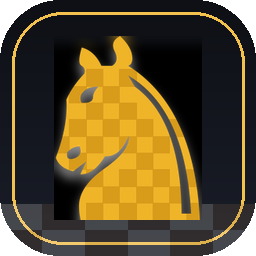

<p align="center">
  
</p>

<h1 align="center">TALOS — The Living Chess Studio</h1>

<p align="center">
  <a href="https://github.com/Mylittlestories/talos/releases/latest"></a>
  <a href="https://mylittlestories.github.io/talos/"></a>
  <a href="LICENSE"></a>
</p>


A modern, fully local chess playing, training and *land-building* suite,
inspired by [Lucas Chess](https://github.com/lukasmonk/lucaschess) and advanced
in every direction — plus **Battle Chess** as a feature: capture a piece and a
procedurally generated 3D fight plays out, ending with the loser losing its
head, being flattened, or shattering into simulated debris.

Everything runs on your machine. No accounts, no servers, no telemetry.

> **New in 2.2.0 — Three lands, sharper play.** The improved edition brings
> three independently persistent land games, a fifteen-tier chess ladder,
> smarter territory opponents, a paced procedural Battle Chess stage, responsive
> browser boards, dependable player-data storage, and native delivery for
> Windows, Linux and Android. [Read the full 2.2.0 notes](CHANGELOG.md#220--three-lands-sharper-play).

```
python run.py
```

---

## Five editions, one codebase

| Edition | How you get it | Notes |
|---|---|---|
| **Browser** | **[Play now](https://mylittlestories.github.io/talos/web/)** — or serve `web/` locally | nothing to install; works offline after its first successful visit |
| **Android APK** | `talos-android-<version>-debug.apk` in every completed tag release; a signed `…-release.apk` is attached when the maintainer configures signing | native Android WebView shell, API 23+; sideload the debug APK for testing |
| **Windows** | `talos-<version>-windows-x86_64-setup.exe` or `…-portable.zip` from the release | proper per-user installer, optional `.pgn` “Open with” entry that loads the selected game, no administrator prompt |
| **Linux** | `talos-<version>-linux-x86_64.tar.gz` → extract → `./install.sh` | self-contained PyInstaller bundle; installs into `~/.local` with a working desktop launcher, icon and AppStream metadata |
| **macOS** | `talos-<version>-macos-universal.zip` | unsigned app bundle; right-click → Open on its first launch |

Every edition runs the same chess and land-game core. The browser and native
Android shell execute the copied Python modules under [Pyodide](https://pyodide.org)
in a Web Worker; desktop editions run them on CPython. There is no separately
maintained “web engine” — `web/python/lc/core/engine.py` is a byte-for-byte copy
of `lc/core/engine.py`, regenerated by `tools/build_web.py` for every build.

The APK contains the browser payload rather than merely opening a hosted URL.
Its only user-facing device permission is Internet because Pyodide's pinned
runtime is fetched on first boot. (AndroidX also creates an app-private receiver
permission.) It requests no contacts, storage, location, camera, microphone or
advertising permissions. The PWA remains an optional browser install, not the
only Android delivery path.

The only desktop-only feature is Battle Chess mode, because it needs real-time
OpenGL. Everything else — the engine and its 15 levels, the puzzle sets, the
learning coach, Anarchchess, Anarchess SOLO and Anarcheckers — is shared across
the supported editions.

To try the browser edition straight from a clone:

```bash
python tools/build_web.py          # writes web/python/, web/data/, web/icons/
python -m http.server 8080 --directory web
# -> http://localhost:8080
```

---

## What is in the box

### Play
* **Standard chess + 12 variants**: Chess960, Crazyhouse (with piece pockets
  and drops), Atomic, King of the Hill, Three-check, Horde, Racing Kings,
  Antichess, Giveaway, Suicide — plus the two TALOS originals below.
* **Human vs engine, human vs human, engine vs engine**, any combination,
  any colour.
* **15 strength profiles** (Pawn through Grandmaster+, nominally 800 → 2550)
  and **7 personalities** (Balanced, Aggressive, Defensive, Positional,
  Tactical, Solid, Wild). The labels communicate deliberate search/error
  tiers rather than calibrated over-the-board ratings. Weak levels are
  genuinely weak *and* human-like: they blunder, make small inaccuracies, and
  see the board through their own bias. The browser also offers Quick,
  Balanced and Deep thinking budgets without erasing the selected profile’s
  depth cap.
* **Any UCI engine** (Stockfish, Lc0, …) with its own time budget, depth,
  `Skill Level` or `UCI_Elo` cap. One-click Stockfish installer is built in
  (`Engines ▸ Install Stockfish`); engines already on your `PATH` are found
  automatically.
* **Clocks**: presets from 1 min to 30+20, fixed seconds per move, or
  unlimited, with increment, move counter, low-time ticks and flag detection.

### Anarchchess — the house rules, as a real playable variant
The rules the community actually plays, collected from r/AnarchyChess and the
Anarchchess bots, each one a switch you can turn off
(`Anarchy ▸ Choose the rules…`).

| Rule | What happens |
|---|---|
| En passant is forced | If it is on the table you must take it |
| Knooks | Move a knight onto a friendly rook and they fuse: rook *and* knight powers in one piece (drawn with an amber badge) |
| c4 is explosive | The first piece to land on c4 detonates and kills a one-square ring — rooks and knooks shrug it off |
| Double check wins | Give a double check and the game is over |
| The king cannot go to c2 | On either side of the board |
| Il Vaticano | Two friendly bishops three squares apart on a diagonal swap places and take everything between them |
| Siberian Swipe | An unmoved rook takes the enemy rook across the board on the same file |
| Vertical castling | King and rook trade places along their file |
| Knight boost | Promoting to a knight earns an immediate extra move |
| Dismount | A knight that has just moved may become a pawn |
| Radioactive queen decay | Taking a queen irradiates the square: the neighbours die too |
| *Full anarchy adds:* | the omnipotent pawn, promotion roulette, the hyper-accelerated Bongcloud win, and random events every turn |

Two presets ship ready: **Anarchchess** (the eleven famous rules) and
**Full anarchy** (everything, including the chaos). The built-in engine plays
both — it only ever asks python-chess what is legal, so a new rule needs no
engine changes.

### Anarchess — the land before Chess
An implementation of **Anarchess** by Dimitris Grammenos (FORTH), following
its published Quick Guide and Detailed Guide. Chess-land before the White and
Black kingdoms, when the "pawns" were free entities.

The standard game is two tribes sharing 32 light and 32 dark tiles; TALOS also
offers three- and four-player local tables as an extension. A turn is simple:

1. **Roll and lay the tile.** The die chooses its colour; the player of the
   opposite colour opens the game. A tile touching only one neighbour must
   touch the opposite colour.
2. **Then, optionally, one pawn action:** settle a pawn onto the tile just
   laid (if its area is empty), step orthogonally, or attack diagonally.

After the last tile's pawn action, each **area of two or more same-coloured
tiles** scores for the player who holds most of its pawns. Tiles are normally
worth 2 points, or 3 for a colour/single-pawn bonus; the largest area is taxed
to 1 point a tile, and every pawn left in reserve costs 6.

**Anarchess SOLO** is a one-player 192-point challenge in which you play both
tribes and must make the prescribed pawn action when one is available.
**Anarcheckers** is the published jump-and-chain-capture variant. They are
three independent entries in both desktop and browser editions—not modes
attached to an Anarchess session—and each keeps its own board and controls.

### Analysis
* Continuous analysis with a vertical evaluation bar, MultiPV candidate
  lines (click a line to see it on the board) and an evaluation graph.
* Three-step graded hints: the target square, then the piece, then the move.
* **Analyse the whole game**: every move gets an evaluation, a centipawn-loss
  figure and PGN NAGs (`?`, `??`, `!!`), so blunders stand out in the move
  list and in the exported PGN.
* Right-drag to draw arrows, right-click to mark squares, `Esc` to clear.

### Training — 14 modes on real Lucas Chess data
The importer converts the original Lucas Chess data files (tactics, mates,
endgames, STS, 40H openings, game database) into one SQLite file:
**112,198 puzzles in 182 sets, 10,000 games, 6,633 openings — 24 MB**.

| Mode | What you do |
|---|---|
| Tactics & mates | Play the solution line; the opponent answers from the line |
| Strategy (STS) | Find the best move — scored in points, like the real STS |
| Endgame technique | Win real endgame positions against the engine |
| Guess the move | Reproduce the move played in a master game (BMT/albums) |
| Openings | Play moves that master practice knows, with frequency stats |
| Everest | Climb a ladder of positions taken from real games |
| Resistance | Survive; the engine gets stronger the longer you last |
| Your Elo | Play a game, get a rating estimate from your centipawn loss |
| Blindfold | The board hides after a few moves |
| Turn on the lights | Memorise highlighted squares, then click them back |
| Routes | Guide a piece to a square in as few moves as possible |
| Square colours | Name the colour of a square, against the clock |

### The learning coach
Every drill you answer is remembered (`Train ▸ Learning coach…`, `Ctrl+J`).

* **Spaced repetition (SM-2)** moves each puzzle to the day you are about to
  forget it: right answers stretch the interval, quick answers stretch it
  further, hints shrink it, and a card that keeps slipping is flagged and
  pushed back to the front of the queue.
* **A rating per theme** — tactics, mates, endgames, strategy, openings,
  calculation, visualisation, memory — updated against the difficulty of
  whatever you just attempted, so missing a mate in one costs more than
  missing a mate in four.
* **A plan, not a to-do list**: `Review what is due` builds a session out of
  exactly the cards whose day has come; `Train my weakest theme` opens the
  mode that matches your lowest bar.
* Mastery bars, a seven-day forecast, recent accuracy and one sentence of
  advice, all stored in your own database.

### Database & PGN
* Save/load games to the built-in database, import and export PGN,
  replay any game by clicking the move list.
* **Master game database**: 10,000 real games, browsable and replayable.
* **Opening explorer**: for the current position, the moves played in the
  database with frequency, score and average Elo.

### Battle Chess mode
`Battle ▸ Battle Chess` (or `Ctrl+B`) swaps the flat board for TALOS's original
living 3D stage. It takes the *idea* of classic animated chess as inspiration,
not its code, models, animation data, sound library or other proprietary media:

* Pieces, the stepped arena, warm stage lights, debris and foley are generated
  locally at runtime — no downloaded art assets or copied classic-game media.
* Thirty attacker/victim pairings have their own named encounter and paced
  approach, strike, impact and recovery beats. A pawn scuffles, a knight
  slashes, a bishop uses light, a rook brings weight, the queen shocks and the
  king swings a sceptre; victims topple, crumble, shatter, spin or dissolve in
  a deliberately stylised fantasy tone.
* **Four practical animation modes** let the player choose the rhythm:
  **Full stage**, **Combat only**, **Walks only**, or **Still board**. Castling
  moves both pieces together; promotions transform in sparks; a short duel
  caption and gentle camera focus make captures legible.
* `Battle ▸ Gore ▸ Classic` enables stylised splashes and stains; **Arcade**
  keeps the same encounters with dust, sparks and rubble instead. Captured
  pieces leave simulated shards with gravity, bounce and spin either way.
* Orbit and zoom with the mouse, choose classic/cinematic/top-down camera
  presets, and tune mesh quality from Low to Ultra.
* The authoritative chess model remains in charge. Input, analysis, engine
  replies and final-result dialogs wait for an active stage beat rather than
  erasing it, so normal chess, training and variants stay usable.
* If OpenGL cannot start, TALOS explains the issue once and returns to the 2D
  board without losing the current game.

---

## The built-in engine

A from-scratch alpha-beta engine: tapered evaluation, piece-square tables,
null-move pruning with verification, late-move reductions, futility and
reverse-futility pruning, late-move pruning, SEE-ordered captures, killer and
history heuristics, a transposition table, quiescence search with SEE and
check evasions, and multi-threaded root splitting.

Tuning is measured, not guessed. `tools/bench.py` scores the engine against
real Lucas puzzles:

| stage | solved (150 puzzles, 400 ms/move) |
|---|---|
| before the ablation study | 88 (58.7%) |
| **shipped** | **109–110 (72.7–73.3%)** |

The single biggest win came from a leave-one-out ablation over every pruning
heuristic, which showed **razoring was costing 22 puzzles** — a static
evaluation far below alpha is exactly what a sacrifice looks like — so it is
off by default. Re-run the study with `python tools/bench.py --count 150`.

---

## Install (desktop)

```bash
git clone <this repo> talos && cd talos
python3 -m pip install -r requirements.txt
python run.py
```

Requirements: Python 3.9+, PyQt6, python-chess, PyOpenGL (for Battle mode).
On Linux you may also need the Qt runtime libraries — `tools/setup_env.sh`
installs them on Debian/Ubuntu.

### Build the desktop distributions

```bash
python -m pip install -r requirements.txt pyinstaller
pyinstaller packaging/talos.spec --noconfirm --distpath dist
```

* **Windows** — on Windows, compile the real installer after the bundle:
  `iscc /DMyAppVersion=2.2.0 packaging\windows-installer.iss`. It writes
  `dist/installer/TALOS-Setup-2.2.0-x64.exe`; the release workflow also makes
  a portable ZIP.
* **Linux** — test the same installer script used inside the release archive:
  `bash packaging/linux-install.sh dist/talos`. It installs the complete bundle
  under `~/.local/lib/talos`, a launcher under `~/.local/bin`, and the desktop,
  icon and AppStream files. Use `--uninstall` to remove it.
* **macOS** — the same spec produces `dist/TALOS.app`.

`packaging/README.md` has the complete desktop recipes.

### Build and test the browser edition

```bash
python tools/build_web.py     # shared Python core, vendored python-chess, puzzles, icons
npm install --no-save --no-package-lock pyodide@0.27.7 jsdom
node tools/web_smoke.mjs      # boots the real Pyodide payload
node tools/web_dom_check.mjs  # drives the real browser UI in jsdom
python tools/app_smoke.py     # drives the desktop application itself
```

The result in `web/` is a plain static site: deploy it to any HTTPS host or run
it from a local file server. It can also be installed as a PWA in a mobile
browser.

### Build a native Android APK

The tracked Capacitor project in `android/` packages that local `web/` payload
inside an Android application, instead of treating “Add to Home Screen” as an
APK. With Node 20+, JDK 21 and Android SDK API 35 installed:

```bash
npm ci
python -m pip install chess   # only python-chess is needed to build the web payload
npm run android:debug
# -> release/talos-android-2.2.0-debug.apk
```

Use `adb install -r release/talos-android-2.2.0-debug.apk` on a test phone.
A debug APK is installable but is not suitable for public distribution; a
release owner adds protected keystore secrets and runs `npm run android:release`
to produce the signed artifact. See
[`packaging/android/README.md`](packaging/android/README.md) for signing and
first-boot network details.

### Build the presentation

```bash
python tools/make_deck.py     # -> presentation/index.html (self-contained)
```

One file, no internet needed. `←`/`→` to move, `O` for the overview, `F` for
fullscreen, `P` to print. Every number in it is generated from the source, so
it cannot drift from the code.

## Releases

Push a `v*` tag and GitHub Actions does the rest:

* Windows produces both a portable ZIP and an Inno Setup `.exe`; Linux produces
  a self-contained tarball whose `./install.sh` has all of its resources;
  macOS produces its app ZIP; the browser job produces a self-hosting ZIP;
* Android builds and smoke-checks an installable debug APK. It additionally
  attaches a signed release APK only when all four protected signing secrets
  are configured — the workflow never invents or commits a signing key;
* the release notes are lifted out of `CHANGELOG.md` for that version
  (`tools/release_notes.py`);
* `SHA256SUMS.txt` is generated;
* a **draft** release is opened with everything attached — nothing is public
  until somebody reads it and presses publish;
* the Pages site is rebuilt: the presentation at `/`, the playable app at
  `/web/`.

Check a downloaded bundle with `sha256sum -c SHA256SUMS.txt`.

```
talos/
├── run.py                 launcher
├── requirements.txt
├── data/lucas.db          imported Lucas Chess content (24 MB, ships ready)
├── engines/               drop your UCI engines here (or use the installer)
├── web/                   browser payload copied into the Android shell
│   ├── index.html         play / train / three land games / rules
│   ├── js/                board, worker, engine wrapper, views
│   ├── python_src/bridge.py   the only web-specific Python file
│   ├── python/            generated: the real core + vendored python-chess
│   └── icons/             generated from assets/ by build_web.py
├── android/               tracked Capacitor / Gradle Android APK project
├── capacitor.config.json  native shell configuration for the local web payload
├── package.json           pinned Capacitor build tooling
├── presentation/index.html    the deck (generated by tools/make_deck.py)
├── packaging/             PyInstaller spec, .desktop, AppStream, installers + APK signing helpers
├── tools/
│   ├── build_web.py       builds web/ from the real modules
│   ├── web_smoke.mjs      boots the payload in Pyodide and plays it
│   ├── web_dom_check.mjs  drives the real browser UI in jsdom
│   ├── app_smoke.py       builds the window and plays through every mode
│   ├── make_deck.py       builds the presentation
│   ├── make_icon.py       builds the icon set in assets/
│   ├── release_notes.py   lifts one version out of CHANGELOG.md
│   ├── selftest.py        139 headless checks
│   └── bench.py           engine benchmark / ablation harness
└── lc/
    ├── core/              engine, UCI driver, game model, players, clocks
    │   ├── engine.py      the built-in alpha-beta engine (all variants)
    │   ├── uci.py         UCI client (Stockfish & friends)
    │   ├── players.py     player abstraction + levels and personalities
    │   └── game.py        board, clocks, variants, PGN
    ├── variants/          Anarchchess: the house rules as a board class
    ├── anarchess/         Anarchess: rules, bot, board widget
    ├── ui/                Qt widgets: board, panels, dialogs, theme, sounds
    ├── battle/            3D Battle Chess: meshes, physics, choreography, gore
    ├── training/          14 training sessions, panel and the learning model
    └── data/              importer, Stockfish installer, opening explorer
```

## Keyboard

| Key | Action |
|---|---|
| `Ctrl+N` / `Ctrl+Shift+N` | New game / repeat last settings |
| `Ctrl+Z` | Takeback (your move and the reply) |
| `Ctrl+R` | Resign |
| `Ctrl+H` | Hint (three grades) |
| `Ctrl+B` | Toggle Battle Chess 3D |
| `Ctrl+A` | Analyse the whole game |
| `Ctrl+J` | Learning coach |
| `Ctrl+Shift+A` | Anarchess |
| `Ctrl+S` / `Ctrl+O` / `Ctrl+E` | Save / import / export PGN |
| `F` | Flip the board |
| `Esc` | Stop training, clear arrows |
| right-drag / right-click | Draw arrows / mark squares |

## Data provenance and licence

* The training content is imported from the **Lucas Chess** project by
  Lukas Monk (GPLv2 or later). `lc/data/importer.py` rebuilds
  `data/lucas.db` from a checkout of that repository:
  `python -m lc.data.importer ~/lucaschess`.
* **Anarchess** is a game by **Dimitris Grammenos** (Institute of Computer
  Science, FORTH). TALOS is an independent software implementation of the
  published Anarchess Quick Guide v1.8, Detailed Guide v1.7, SOLO and
  Anarcheckers rules; it does not bundle the original game artwork or manuals.
* TALOS itself is released under the **GNU GPL v2 or later**, in the same
  spirit as the project that inspired it.
* All graphics in this build are drawn procedurally at runtime (Qt vector
  paths for the desktop 2D pieces, resolution-independent inline SVG for the
  browser chess pieces, DPR-aware canvas art for the land boards, and generated
  3D meshes) and all sound effects are synthesised — no third-party art or
  audio is bundled.

## Notes and troubleshooting

* **Battle mode says 3D is unavailable** – install PyOpenGL
  (`pip install PyOpenGL`) and make sure OpenGL works on your machine. The
  game keeps every feature in 2D if it cannot start.
* **No sound** – the sound bank disables itself when the machine has no audio
  output device (this avoids multi-second stalls on headless Linux).
* **Stockfish** – `Engines ▸ Install Stockfish` downloads a build for your
  platform; the binary is ~110 MB, which is why it is not shipped in the
  repo. The built-in engine needs nothing extra and plays all variants,
  including the ones Stockfish cannot.
* **Check yourself** – `python tools/selftest.py` runs 139 headless checks
  over the engine, every variant, the Anarchchess rules, the three land games,
  the learning model, training modes, database, UCI driver and Battle Chess
  simulation (no display required). `python tools/app_smoke.py` builds the
  real window and exercises the independent Anarchess, SOLO and Anarcheckers
  entries; `tools/web_smoke.mjs` and `tools/web_dom_check.mjs` do the same for
  the browser edition.
* **Screenshots** – `python tools/capture_preview.py` renders the real
  application into `preview/`. It needs a display: on a headless machine run
  it under `xvfb-run -s "-screen 0 1600x1000x24"`.
